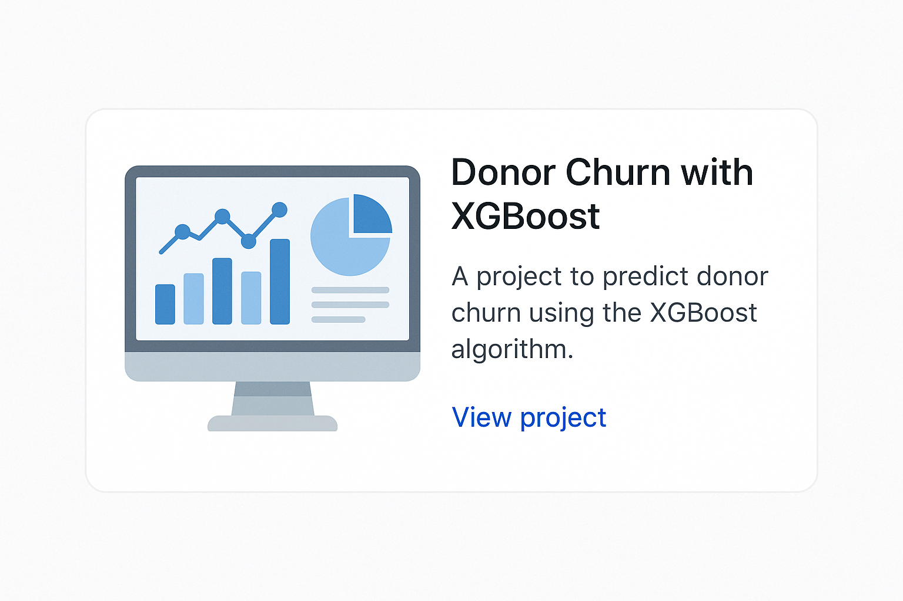

# driessenberend.github.io

### Introduction

### Articles
#### Technical reads
[What is MLOps?](driessenberend.github.io/articles/MLOps.md)
[What is DevOps?](driessenberend.github.io/articles/MLOps.md)
[How to build great software (technically)](driessenberend.github.io/articles/MLOps.md)

#### Non-technical reads
[Why technical innovation is also always social innovation; a guide for real change](driessenberend.github.io/articles/MLOps.md)
[UI and UX principles for a seamless user-experience](driessenberend.github.io/articles/MLOps.md)
[The Twin Transition; the architecture and role of tech in a green world](driessenberend.github.io/articles/MLOps.md)

### Projects

  

    
    <h4>Customized company chatbot with memory, chat history and safe data processing</h4>
    
"How can I build a ChatGPT-like application that my employees can use safely and that is tailored to the specific needs of our company?" That is a question a lot of organisations struggle to answer. In this project, I am going to tackle that problem by explaining the project architecture, the build and the deployment. In addition I will explain how to build in the necessary safety features guardrails, for example by blocking certain content and monitoring and managing application usage. 

    <a href="./projects/donation-forecast.html">View LLM Chatbot project</a>
  

  
  

    
    <h4>PolicyWatch: automatic monitoring of policy documents, building files and writing policy documents. po</h4>
    
1)Public service officials, public affairs professionals and journalists are spending a lot of time searching, reading and writing (policy) documents. In this project, I will explain how to leverage LLM's to make their life easier. We will be building an application that will automatically pull data from official sources and let users monitor relevant documents based on their interest. In addition to this, we will let users build files around certain topics, and leverage AI to automatically write (policy) documents based on these files and specific instructions. In summmary we will build an application that:
    1) Synchronizes and imports policy data from various official sources such as government website API's
    2) Build a semantic search engine to let users search through this data based on relevance
    3) Let users build an interest profile with keywords based documents will be automatically summarized and send to them by email
    4) Let users add documents to a file, for example around a certain topic, and let AI automatically summarize these files or let AI write policy documents based on these files and user instructions, including references

    <a href="./projects/feature-dashboard.html">View PolicyWatch project</a>
  

  

    
    <h4>Automatic matching and writing of grant applications using web scraping, company information and interview transcripts.</h4>
    
Writing grant applications is time-intensive and requires knowledge of specific writing styles and argumentation. In this project, I will explain how to build an application that will match companies with potentially interesting grant opportunities, and write concept grants based on company information and interview transcripts.

    <a href="./projects/feature-dashboard.html">View Grant Application project</a>
  

  

    
    <h4>Market prediction: estimating price movements in natural resources using advanced algorithms</h4>
    
Quantative finance revolves around letting algorithms learn the characteristics of the price movements in specific markets. In this quantative finance project, I will explain how to build an application that can predict market prices based on historical price data, and suggest trading strategies to users based on these predictions. 

    <a href="./projects/feature-dashboard.html">View Market Prediction project</a>
  

  
  

    
    <h4>Predicting donor churn with XGBoost</h4>
    
Donors that are not actually coming to their blood donation appointments are a costly endeavour for blood banks. In this project, we will therefore explain how to train an algorithm than can predict if donors come to their appointment using the XGBoost algorithm. The algorithm will suggest whether or not a donor falls into the 'high risk' category that 

    
<a href="https://link-naar-project">View Donor Churn project</a>

  

